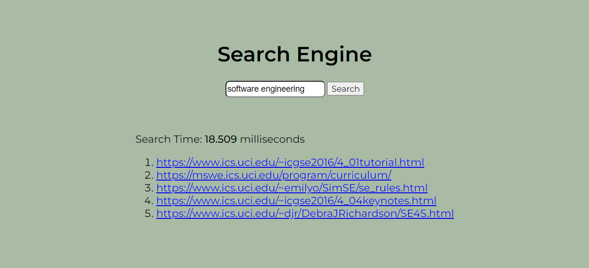

# Search Engine

I built a lightweight yet powerful search engine in Python capable of processing a web corpus of over **100,000+** documents and responding to queries in under **300ms**. It utilizes **porter stemming**, **TF.IDF** scoring, and HTML tag-based **weighting** to retrieve the most relevant web pages from the entire corpus for a given query.

<div align="center">
  
</div>

## Project Overview

This project is composed of two main components:

1. `indexer.py`:  Indexes a corpus of HTML documents.
2. `searcher.py`: Queries the indexed data and returns the URLs of the most relevant results.


Before the search engine can be run, the corpus must be **indexed** in order to efficiently respond to queries. The search engine utilizes an **inverted index** which maps tokens to a list of documents containing the token. You can read more about the indexing process [here](#Indexing-Process). Once the corpus is indexed, you can query the corpus in which the search engine will return the top 5 most relevant URL's pertaining to the query.

This repository provides a small corpus of documents located in [`CORPUS/`](CORPUS/) as an example of how the indexer expects the folder to be structured. To generate a larger more comprehensive corpus of documents you can use my custom [web crawler](https://github.com/steven-rivera/web-crawler). More information on how the corpus folder is structed can be found [here](#CORPUS-Structure).

## Getting Started

### 1. Clone the Repository 

```bash
git clone https://github.com/steven-rivera/search-engine
cd search-engine
```

### 2. Create and Activate a Virtual Environment (Optional)

```bash
# Create a virtual environment named 'venv'
python -m venv venv

# Activate virtual environment
venv\Scripts\activate.bat   # For Windows
source venv/bin/activate    # For macOS/Linux
```

### 3. Install Dependencies

```bash
pip install -r requirements.txt
```

### 4. Configure Paths

Edit the `config.json` file to match your system:

```json
{
  "CORPUS_PATH": "/path/to/corpus",
  "INDEX_STORAGE": "/path/to/store/indexes"
}
```

- `CORPUS_PATH`: Folder containing corpus of HTML documents to be indexed.    
- `INDEX_STORAGE`: Folder to store index files.

> [!IMPORTANT]
> A small sample corpus is provided [here](CORPUS/) showing how the indexer expects the corpus to be structured. To generate your own corpus you can use my [web crawer](https://github.com/steven-rivera/web-crawler) program. 

### 5. Run the Indexer

The corpus **must** be indexed before the search engine can execute a query. After following the previous steps listed run:

```bash
python indexer.py
```

> [!NOTE]
> Indexing time will vary depending on the size of the corpus

### 6. Run the Search Engine

**Console Mode (default):**

```bash
python searcher.py
```

**Web Interface:**

```bash
python searcher.py --webapp
```

## CORPUS Structure

The indexer expects the [`CORPUS/`](CORPUS/) directory to be structed in the following way:

```
./CORPUS/
├── example.com/
│   ├── 0c5b8b4b8e1db4d497b0ff6da2ce9441.json
│   └── ...
├── anotherdomain.org/
│   ├── 1cb2bfd1192fa19346c065cdabc28ae8.json
│   └── ...
```

- `./CORPUS/`: Root folder for all documents
- `example.com`: Subfolder containing `.json` files of documents with the **domain** of the subfolder name
- `0c5b8b4b8e1db4d497b0ff6da2ce9441.json`: A `.json` file named with the **MD5 hash** of the HTML content of the document. Each file has the following structure:

```json
{   
    "url": "https://example.com",   
    "content": "<html>...</html>" 
}
```


## Indexing Process

Before any searches can be performed, the corpus must be indexed. This allows the search engine to efficiently respond to user queries without having to parse the entire corpus for each query. The indexing process involves several key steps:

### 1. Document ID Assignment

Each document in the corpus is incrementally assigned an integer ID which maps to the corresponding URL of the document, starting with ID `0`. This reduces the size of the index on disk as the index only needs to store an integer to refer to a document rather than its entire URL. In order to preserve the ID to URL mapping, each documents' URL is saved to a text file where line `N+1` contains to the URL for the document with ID `N`. 

### 2. Inverted Index Construction

For each document processed, a **tokenizer** extracts and normalizes tokens contained within the document. These tokens are then used to build an **inverted index** where every unique token maps to a list of **postings**. Each posting includes:

- `Document ID`: The ID of the document where the token appeared.
- `Token Frequency`: How many times the token appeared in the document.
- `Token Importance`: An integer weight based on the HTML tag the token appeared in. For example:
    - `<title>`: highest weight
    - `<h1>`, ..., `<h6>`, : descending weights
    - `<p>`: lowest weight

The inverted index is stored on disk as a `JSONL` file,  with each line containing a `JSON` object with the following structure:

```json
{
  "TOKEN": [
    {
      "docID": 0,
      "tf": 1,
      "i": 10,
    }, 
  ]
}
```

> [!NOTE]
> When indexing a large corpus the size of the index may exceed the amount of memory available on the machine, causing the indexer to fail. To prevent this, the index is periodically saved to disk once it reaches a certain size. Once all the documents in the corpus are parsed, the indexer must merge all of these partial index files into a single unified index file before continuing to the next step.

### 3. TF.IDF Calculation

Once all documents have been processed, the **Term Frequency-Inverse Document Frequency (TF.IDF)** score for each token-document pair is calculated and the index is updated. This score is what the search engine uses to rank documents based on a given query. You can read more about how the score is used and calculated [here](#document-ranking).

Once the TF.IDF score is calculated, it is no longer necessary to store the `tokenFrequency` and `tokenImportance` keys in the index. The updated index is stored on disk as a `JSONL` file as before, but with each line containing a `JSON` object with the following structure:

```json
{
  "TOKEN": [
    {
      "docID": 0,
      "tf_idf": 2.4727564493172123
    }, 
  ]
}
```

### 4. Meta-Index Creation

To avoid loading the entire inverted index into memory — which could be larger than the available memory on the machine — a **meta-index** is also created. It maps each token in the index to its **byte offset** within the index file on disk. This allows:

- Fast access to specific token postings using `seek()`
- Low memory usage during search time
- High scalability to large corpus


## Document Ranking

When a user inputs a query, the search engine tokenizes the query using the same tokenizer used by the indexer. It then calculates the relevance score for each query/document pair by summing the **Weighted Term Frequency-Inverse Document Frequency (TF.IDF)** scores for each token that appears in both the document and query. The URLs of top 5 documents with the highest scores are then returned to the user. The score of a query/document pair $(q, d)$ can be expressed with the following formula: 


```math
\text{Score}(q, d) = \sum_{t \in q \cap d} w_{t,d}
```

where the **weighted TF.IDF** score for a token/document pair $w_{t,d}$ is given by:

```math
w_{t,d} = I_{t,d} \cdot \text{ltf}_{t,d} \cdot \text{idf}_t
```

where:

```math
I_{t,d} \in \mathbb{N}
```

> $I_{t,d}$ is an integer multiplier that gives more weight to documents that contain query tokens within certain HTML tags. For example tokens contained within a `<h1>` tag are considered more "important" than tokens contained within a `<p>` tag. 

```math
\text{ltf}_{t,d} = 
\begin{cases}
1 + \log_{10}(\text{tf}_{t,d}) & \text{if tf}_{t,d} > 0\\ 
0 & \text{else}
\end{cases}
```

- $\text{tf}_{t,d}$: The number of times token $t$ occurs in $d$

> $`\text{ltf}_{t,d}`$ increases the scores of documents that contain query tokens multiple times in the document. For example a document with 10 occurrences of the token is considered more relevant than a document with only 1 occurrence. The logarithm of $`\text{tf}_{t,d}`$ is taken to dampen the effect token frequency has on the relevance score of a document.

```math
\text{idf}_{t} = \log_{10}\left(\frac{N}{\text{df}_{t}}\right)
```

- $N$: Total number of documents
- $\text{df}_t$: Number of documents that contain the token $t$

> $\text{idf}_t$ rewards tokens that are **rare across the corpus**, as those are more useful for distinguishing relevant documents. For example if every document contains a query token $t$ ($\text{idf}_t = 0$), this token gives the search engine zero information on whether a document is more relevant than any other document. On the contrary, if only a single document contained a query token $t$, this would be a strong signal to the search engine that this document is highly relevant to the query.